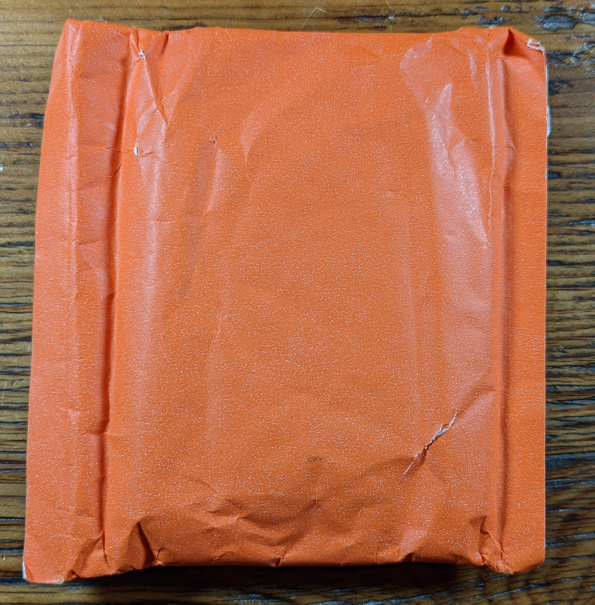
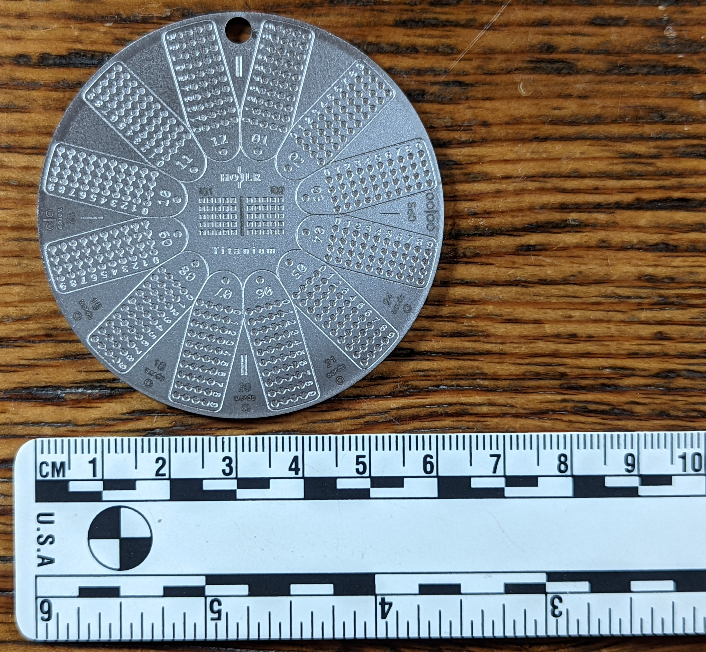
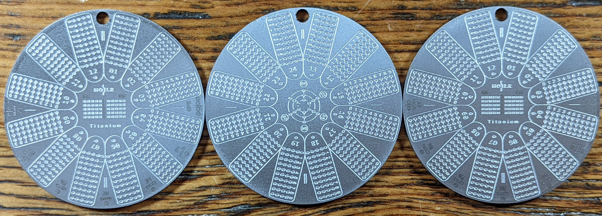

## Unboxing the Hodlr One Titanium
The Hodlr One Titanium is shipped in a standard parcel padded envelope. Inside that is the orange pouch which has only the nondescript barcode markings on it. 

Inside the orange pouch is a vacuum sealed clear bag which contains everything needed to secure a Bitcoin seed phrase, except a hammer.

Inside the clear bag you will find:
- security seals
- one or three titanium Hodlr One plates depending on which package you bought
- a rubber mat to use when stamping
- one steel center punch
- one pencil
- one marker
- thank you card
- detailed instructions
- BIP39 English word index
- SLIP39 English word index
- blank backup sheet

The Hodlr One Titanium plates measure 61mm wide by 2mm thick and they each weigh 26g. 

