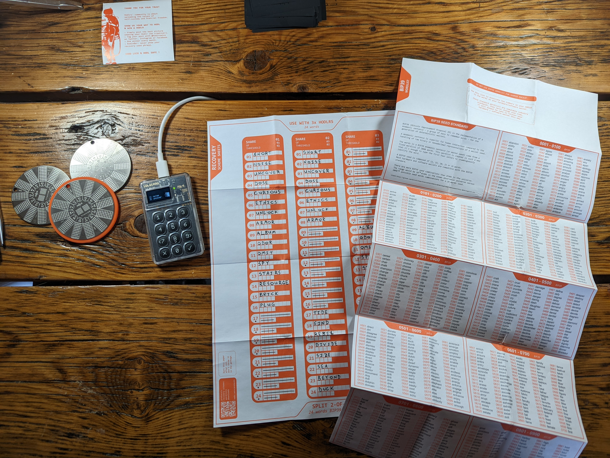
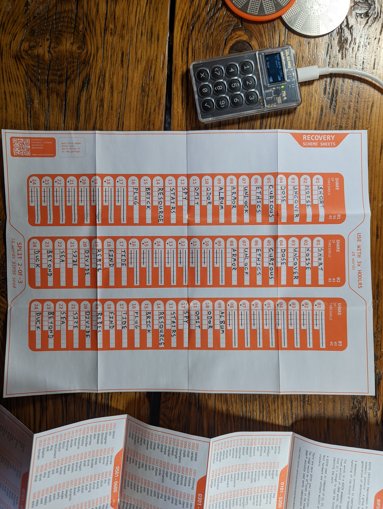
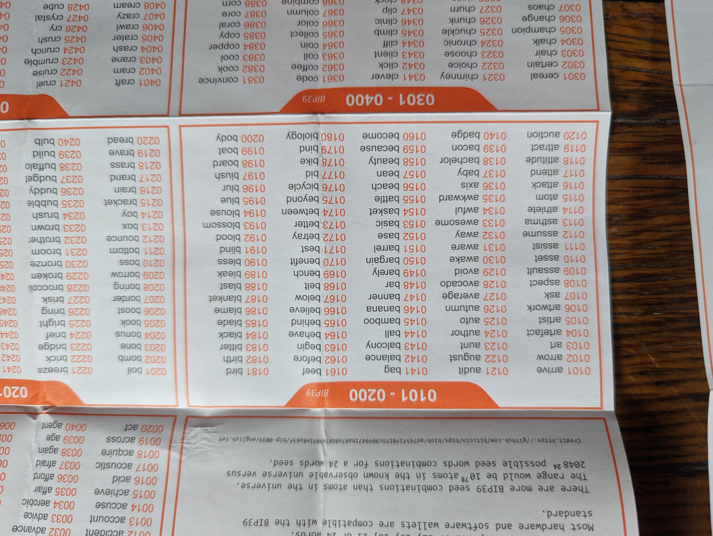

# Converting a Seed Phrase to Index Numbers
In this demonstration, a [COLDCARD](https://coldcard.com/) was used to generate a standard BIP39 24-word seed phrase. You can use any wallet of your choice that supports the BIP39 standard. Alternatively, the Hodlr One Titanium supports [SLIP39](https://slip39.com/) as well but instructions for this method are not covered in this demonstration. The Hodlr One Titanium three-pack is designed to split a 24-word seed phrase into three pieces where if any two of the pieces are recovered, combined they can recreate the Bitcoin private key and recover the bitcoin. 

Careful considerations should be made when deciding to split a seed. For example, there are multiple pieces required to recover bitcoin using this method. This could be a security benefit if one piece is discovered by an adversary then they will not have enough information to recover the bitcoin. However, this could also be a draw back if two pieces are lost then the bitcoin cannot be recovered. 

In the Hodlr instructions, each of the three pieces will receive 16 of the 24-words. The first piece gets words 1-16, the second piece gets words 1-8 & 17-24, and the third piece gets words 9-24. This way, if any two pieces are recovered they contain enough information combined to recovery the bitcoin. If an adversary found one of three pieces they would only have 16 out of 24 words, leaving 8 words to be guessed out of 2048 possible word choices. Using the equation log2(2048^8) it can be said that the entropy is 88 bits. If the adversary were to make 100 trillion guesses per second, it would take them 98,000 years to calculate every possible combination of the 88 bits. Although it could be considered a compromise if one piece is discovered, 88 bits of entropy is still reletively secure. But if you do discovery that one of your pieces has been compromised it would behoove you to transfer your bitcoin to a new secure wallet as soon as possible. 

- Next, figure out which words will be stamped into each of the three pieces by using the included recovery sheet.
- Once you have your 24-words from your wallet, write them down in order on the blank recovery sheet. 
- Keep in mind that only 16 of the 24-words will be written down for each of the three pieces. The eight omitted spaces for each piece are crossed out already on the blank recovery sheet.

- After writing down the seed words for each of the three pieces, refer to the included BIP39 index sheet to find the corresponding index number. 
- Write each 4-digit index number beneath every word on your recovery sheet.
- You will be stamping this index number into the Hodlr One Titanium plates. 

It is worth mentioning that the technical specification for [BIP39](https://github.com/bitcoin/bips/blob/master/bip-0039.mediawiki) calls for the word index to range from 0-2047. However, multiple companies use the range 1-2048 in their documentation. This confusion is compounded by the fact that the official [BIP39 word lists](https://github.com/bitcoin/bips/blob/master/bip-0039/bip-0039-wordlists.md) start on 1 and end on 2048, although this is a byproduct of the way GitHub serializes lines in a text (.txt) document, users should be aware that they will derive different values (different bitcoin wallets) if they alternate this index +/- 1 using an mathematical seed tool like [this](https://bitcoiner.guide/seed/) or [this](https://iancoleman.io/bip39/). Be consciencious of the fact that you are using an index range from 1-2048 here. 

- Once you have the 
