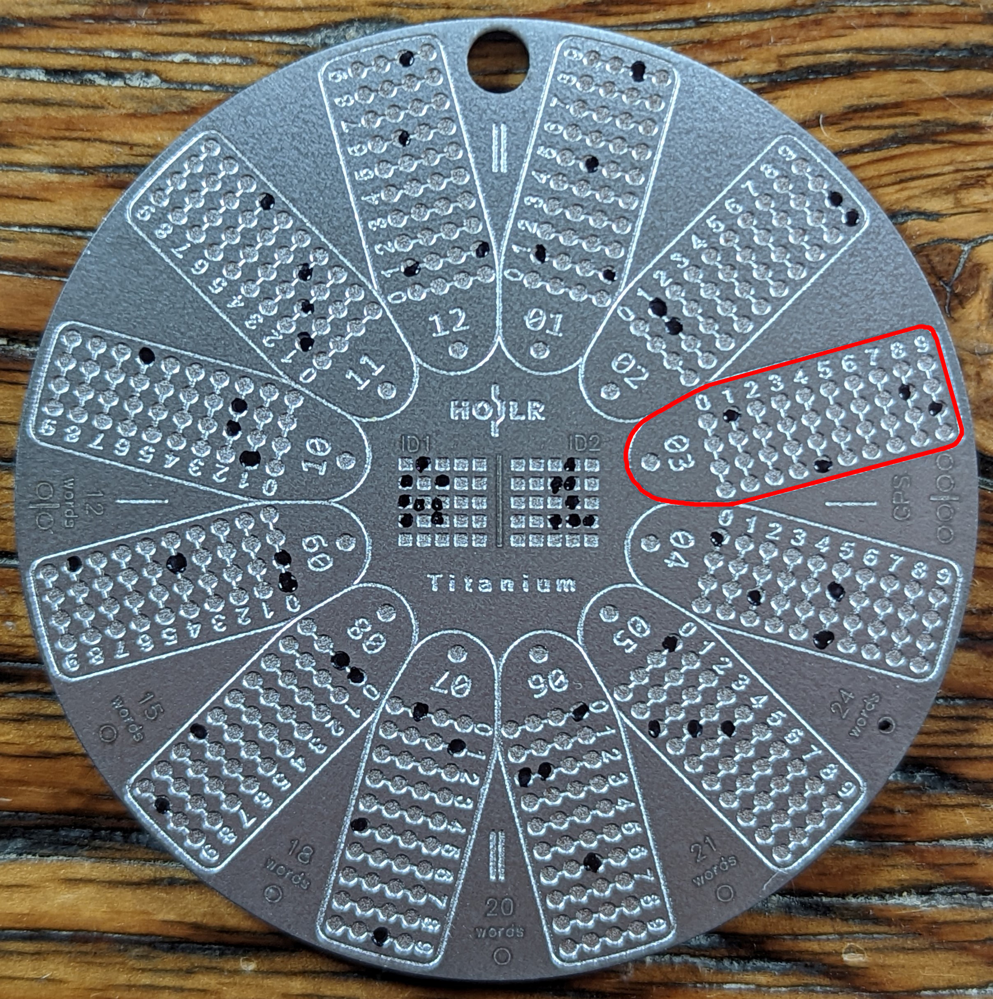
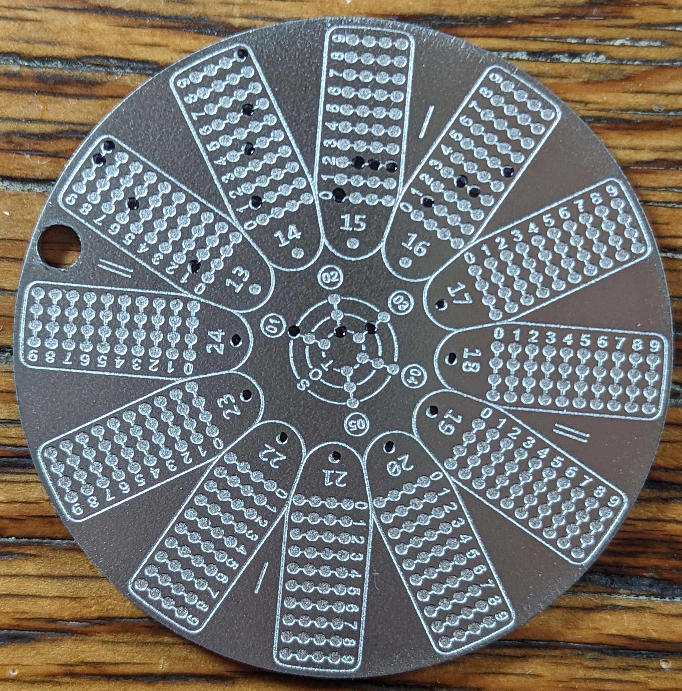
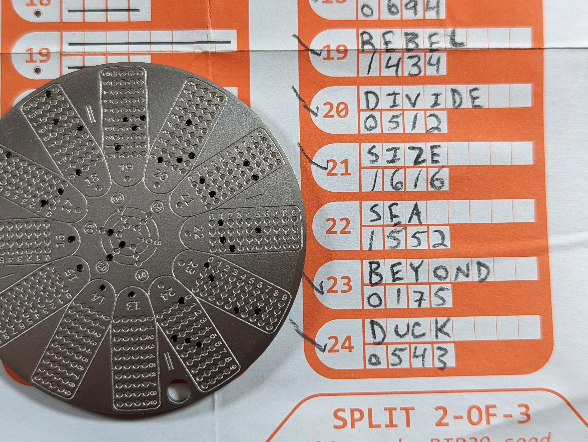

# Pre-Marking and Stamping the Hodlr One Titanium
Once you have the index numbers written down on the recovery sheet below each corresponding seed word, you can pre-mark the three Hodlr One Titanium plates with the provided marker. 

- You want to be sure that you are reading the appropriately numbered section for each word from left to right and top to bottom. In the image below, take #03 for example, the index number is "1894" from the Hodlr instructions for the word "uncover". 
- Continue pre-marking the words according to the written recovery sheet.
- For word spaces that are omitted, indicate them as intentionally left blank by stamping the dot beneath the corresponding word number toward the center of the plate. 
- In the center of each Hodlr One Titanium plate you will notice two small grids for ID1 & ID2, you can use this a couple different ways depending on whether you have a 12-word seed phrase or a 24-word seed phrase. You can use it to identify multiple plates as belonging to the same seed phrase, like "A1" for example, all three pieces for this seed phrase will share the "A1" identifier. Or you could use it to identify multiple 12-word phrases like "A1" on the first plate, "A2" on a second plate, and "A3" on a third plate. 
- Along the edge of the plate you will notice that you can indicate how many words are in your seed phrase, like "24-words" for example. 
- There is even a place to indicate if you are using the plate for GPS coordinates. You can inscribe the numbers from GPS coordinates into the plate to create a robust backup that can be used to keep the location of your Bitcoin backup. 

On the reverse side of each plate there is an icon that reads "SOT", this stands for Share Of Threshold. The way this is interpreted is that the outermost circle indicates which number share this plate is. The second circle indicates the total number of shares in the entire backup. And the innermost circle indicates the minimum threshold of shares required to recover the bitcoin. For example, since this is a three part backup, the outermost circle will be stamped "1", "2", & "3" respectively for each plate. Then the second circle will be stamped "3" on each plate because there are three total pieces. Finally, the innermost circle will be stamped "2" on each plate because two pieces at minimum are required for a recovery.

Be sure to double check your work after pre-marking the plates. If you make a mistake, like the example below, you can fix it by using some acetone and a Q-tip to remove the marker and then indicate the correct circle. Word #22 is "sea" and the corresponding index number is "1552", however "1512" was marked on the plate.

Once you have pre-marked all of your dots on all of your plates, double checked your work by using your hardware wallet to import your seed phrase from the information you have prepared on the plates. 

- This will take some time, but it is worth investing the time now to ensure your backup information will lead you back to your bitcoin so you can sleep well at night.
- Try recovering your seed phrase with your hardware wallet from plates #1 and #2. 
- Once you have confirmed that those two plates work, repeat the process all over again with plates #2 and #3. 
- Once you have confirmed that those two plates work, repeat the process all over again with plates #1 and #3. 
- Now you know for sure, without a doubt, that any combination of two plates will recovery your bitcoin. 
- If you find any mistakes make the necessary corrections.
- Then you are ready to start stamping your marks with the included center punch. Safely destroy the paper recovery sheet by burning it. Do not use a different punch than the one that was included with the Holdr One Titanium kit. This center punch is the appropriate size for the available space on the plates.
- Place the plate in the included rubber mat before hammering. 
- Use a solid surface like a concrete floor.
- Use a heavy hammer to get a solid punch.
- Make each strike count and avoid attempting to strike the same dot twice.

Once stamped, you should have clear well-defined markings that are now a permanent part of the plate. 

