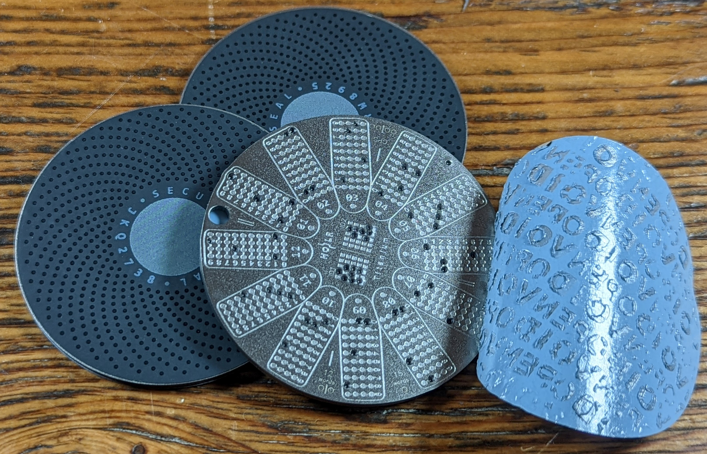

# Security Seals
The objective of the security seal is to obfuscate the stamped markings on both sides of the plate while providing a way to indicate if the markings have been revealed. This is accomplished with tamper-evident security seals that are applied to both sides of each plate. 

Each security seal has a unique serial number on it so that you can make note of exactly which security seal you used to obfuscate your plates. 

If anyone attempts to remove the security seals, they will reveal the words "VOID" & "OPEN". 

Periodically check your backups and immediately recover and move your funds to a new secure wallet if you discover that one of your plates has been tampered with.
