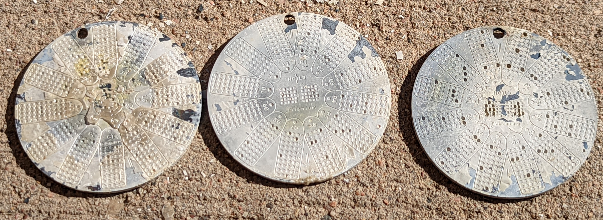

# Fire Test and Recovery
Titanium has a melting point of 1668°C which is roughly 250°C higher than stainless steel and roughly twice as high as the average house fire. Titanium is also highly resistive to corrosion and has been used widely in the aerospace and pressure vessel industries for the last 70 years. These attributes make it a superior medium to secure your Bitcoin seed phrase. 

Here is a video of a fire test bringing the three Hodlr One Titanium plates up to melting point to ensure that the information they contained would be recoverable. 

The information contained in the Hodlr One Titanium plates was 100% recoverable. There was a flaky yellow/white material left behind after the fire test which was cleared off using a brass-bristle brush. Then the numbers stamped in each plate were transcribed onto a piece of paper and then converted back to the corresponding words using the 1-2048 indexed BIP39 English word list. 

## Conclusion
The Hodlr One Titanium is a robust Bitcoin backup medium that is simple to use and easy to conceal. There are clever ways to stamp many details about your backup like how many words it has in total, how many shares your entire backup contains, how many of those shares are required for a recovery, and even if there are accompanying GPS coordinates. Anytime there is a conversion involved between seed words and index numbers, use caution. Check out the Hodlr Swiss website to learn more about their high quality products: https://hodlr.swiss/ or follow them on Twitter: https://twitter.com/hodlrswiss
