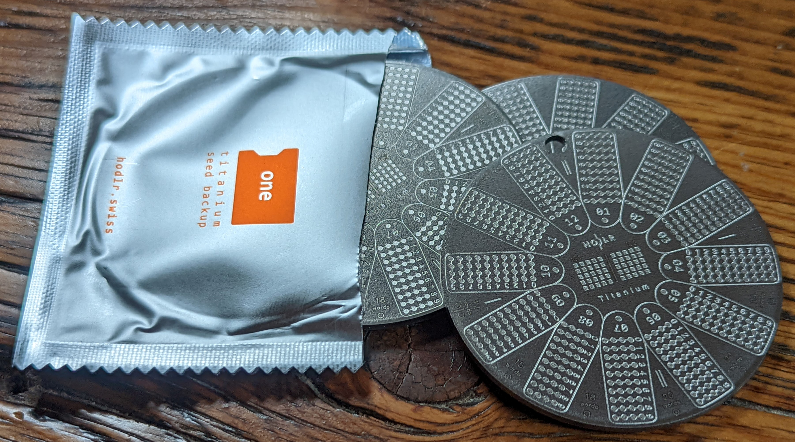
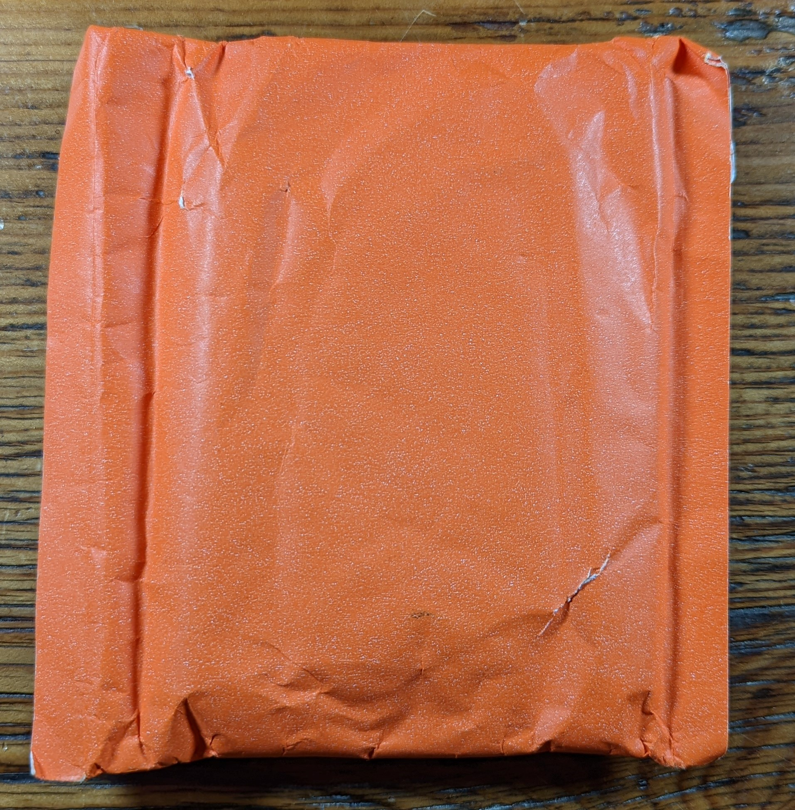
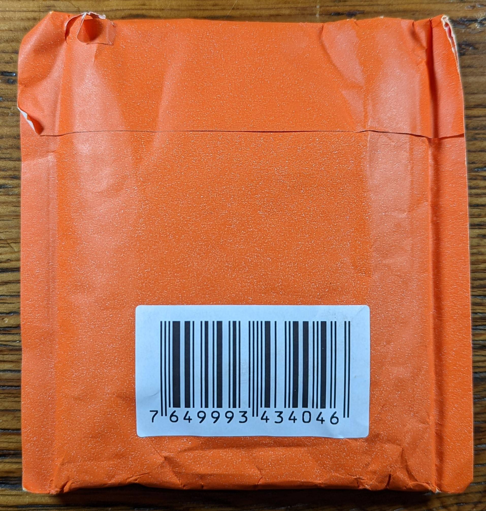

# Hodlr One Titanium 

## Introduction
This article demonstrates how to use the Hodlr One Titanium Bitcoin backup from [Hodlr Swiss](https://hodlr.swiss/products/one-titanium). When taking self-custody of your bitcoin it is important to ensure you have a good system in place to backup your private keys. In the event you lose access to your Bitcoin wallet, whether it's a desktop wallet or a mobile wallet or a hardware wallet, your backup is what enables recovering your bitcoin. A widely accepted method used to make this backup information easier for humans to handle is called [BIP39](https://github.com/bitcoin/bips/blob/master/bip-0039.mediawiki). This method involves converting the numbers used to derive your extended private key into human readable words, the 2048 words found on the standardized English [word-list](https://github.com/bitcoin/bips/blob/master/bip-0039/english.txt). Each word on the list corresponds to an index number and no two words on the list begin with the same 4-letter sequence. [Samourai Wallet](https://samouraiwallet.com/), [Sparrow Wallet](https://www.sparrowwallet.com/), [COLDCARD](https://coldcard.com/), [Passport](https://foundationdevices.com/passport/), [SeedSigner](https://seedsigner.com/) among many others are just a few examples of wallets that will present the bitcoin recovery information as a list of words following the BIP39 standard, known as a seed phrase.

The way a user handles their seed phrase is very important because anyone who gains access to these words could steal the bitcoin. Most commonly the seed phrase will be either 12-words in length or 24-words in length, although some wallets support lists of varying lengths. Saving the seed phrase in an unencrypted text document or an image file is never recommended. Writing the seed phrase down on a piece of paper is a good start since this ensures that the words cannot be accessed remotely on an insecure computer. However, paper backups can fail in extreme environmental conditions like fires and floods. Many people have sought out clever ways to use metal as a more secure medium to store their seed words. Hodlr Swiss offers a product designed to make backing up your seed phrase easy and secure. The Hodlr One Titanium backup can withstand temperatures as high as 1668°C, roughly 250° higher than stainless steel and nearly double the average temperature of a house fire. 

## Getting Started with the Hodlr One Titanium
The Hodlr One Titanium is shipped in a standard parcel padded envelope. Inside that is the orange pouch which has only the nondescript barcode markings on it. 

